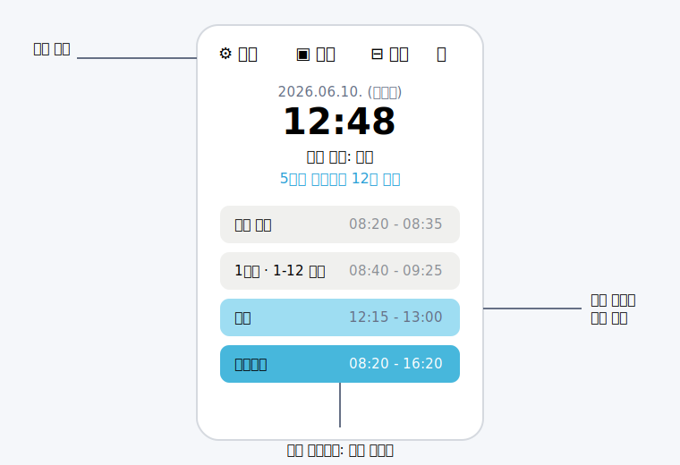
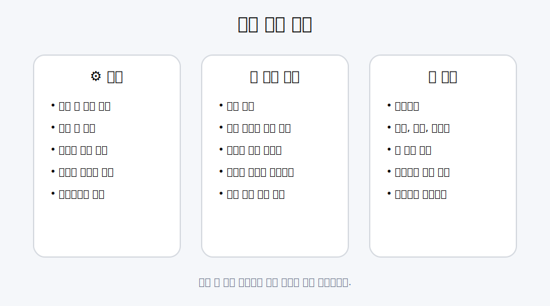

# 지금 몇교시야 사용설명서

## 1. 설치와 실행

### Windows

1. [최신 릴리즈](https://github.com/RamzThunder/whattime-releases/releases/latest)에서 `whattime.exe`를 내려받습니다.
2. 로컬 폴더에 저장한 뒤 실행합니다.
3. Windows 보호 화면이 나타나면 파일 출처를 확인한 후 실행을 선택합니다.

네트워크 드라이브에서 직접 실행하면 연결 지연으로 앱이 멈출 수 있으므로 로컬 폴더 사용을 권장합니다.

### macOS

1. 최신 릴리즈에서 `WhatTime-mac.dmg`를 내려받습니다.
2. DMG를 열고 앱을 Applications 폴더로 옮깁니다.
3. 실행이 차단되면 DMG에 포함된 `install.command`를 실행하거나 시스템 설정에서 허용합니다.

## 2. 메인 화면

메인 화면에는 날짜, 현재 시각, 현재 교시, 다음 일정까지 남은 시간과 오늘의 일정이 표시됩니다.

| 버튼 | 기능 |
| --- | --- |
| 설정 | 시정, 개인 시간표, 디자인과 고급 기능 설정 |
| 배경 | 위젯의 배경 표시 여부 전환 |
| 미니 모드 | 작은 크기의 요약 화면으로 전환 |
| 항상 위 | 다른 창보다 위에 표시 |
| 최소화 | 위젯 최소화 |
| 종료 | 앱 완전 종료 |

창 가장자리를 드래그하면 크기를 조절할 수 있습니다. 아래쪽 슬라이더로 위젯 투명도를 조절할 수 있습니다.

## 3. 설정 화면

설정 화면은 `설정`, `일정 관리`, `고급`의 세 영역으로 나뉩니다. 변경 후 아래쪽 `저장`을 눌러야 적용됩니다.

### 설정

- 부팅 시 자동 실행
- Windows/macOS 스타일 상단 바 선택
- 글꼴, 굵기, 글자 크기 변경
- 전체 배경과 진행바 색상 변경
- 현재 일정, 비활성 일정, 카운트다운 글자 색상 변경

색상 칸의 `+ 추가`를 누르면 자주 쓰는 색상을 저장할 수 있습니다.

### 일정 관리

#### 일반 시정

평소 수업일의 교시 이름과 시작·종료 시각을 입력합니다.

- `+ 교시 추가`: 새 일정 추가
- `×`: 일정 삭제
- `⊘`: 해당 블록에서 카운트다운 제외
- 드래그: 일정 순서 변경

#### 단축 시정

단축수업 시간표와 적용 요일을 설정합니다. 선택한 요일에는 일반 시정 대신 단축 시정이 표시됩니다.

#### 개인 시간표

요일별 수업명과 교실을 입력합니다. 개인 시간표 정보는 메인 화면의 각 교시 아래에 표시됩니다.

컴시간 알리미를 사용하는 경우:

1. 학교 이름을 검색해 학교코드를 선택합니다.
2. 컴시간 교사용 화면에 표시되는 교사 번호를 입력합니다.
3. `이번 주 불러오기`를 누릅니다.
4. 내용을 확인하고 `저장`을 누릅니다.

#### 쉬는 날

주말, 휴일 또는 특별 일정이 있는 날을 지정합니다. 쉬는 날에도 별도 일정을 추가할 수 있습니다.

### 고급

- 앱 업데이트 확인과 설치
- 설정 백업 및 복원
- 현재 설정을 기본값으로 지정
- 설정 초기화
- 학교 종과 위젯 시간의 초 단위 오차 보정
- 밀리초 표시
- 개인 수업 종료 직전 진행바 색상 변화
- 종료 문구와 쉬는 날 문구 설정
- 특정 요일·시각 미리보기

## 4. 자주 쓰는 설정 예시

### 특정 요일만 단축수업 적용

1. `설정 > 일정 관리 > 단축 시정`을 엽니다.
2. 단축 시간표를 입력합니다.
3. 위쪽의 적용 요일을 선택합니다.
4. `저장`을 누릅니다.

### 개인 수업과 교실 표시

1. `설정 > 일정 관리 > 개인 시간표`를 엽니다.
2. 요일을 선택합니다.
3. 각 교시에 수업명과 교실을 입력합니다.
4. `저장`을 누릅니다.

### 위젯을 항상 화면 위에 표시

메인 화면의 `항상 위` 버튼을 누릅니다. 다시 누르면 해제됩니다.

## 5. 데이터 관리

Windows에서는 일정 데이터가 실행 파일과 같은 폴더의 `schedule.json`에 저장됩니다. 앱을 다른 폴더로 옮길 때 설정을 유지하려면 이 파일도 함께 옮기세요.

설정 화면의 고급 탭에서 더 안전하게 관리할 수 있습니다.

- `백업`: 현재 설정을 JSON 파일로 저장
- `복원`: 백업 JSON 파일 불러오기
- `기본값 지정`: 현재 설정을 초기화 기준으로 저장
- `초기화`: 지정한 기본값 또는 앱 기본 설정으로 복원

## 6. 업데이트

앱 시작 시 새 버전을 확인합니다. 업데이트가 있으면 안내 창에서 바로 설치할 수 있습니다.

업데이트가 실패하면:

1. 앱을 완전히 종료합니다.
2. 최신 릴리즈의 실행 파일을 내려받습니다.
3. 기존 실행 파일을 새 파일로 교체합니다.

## 7. 문제 해결

### 앱이 실행되지만 화면이 보이지 않음

1. 작업 관리자에서 `whattime.exe`를 모두 종료합니다.
2. 앱을 다시 실행합니다.
3. 계속 발생하면 최신 버전을 다시 내려받습니다.

### 앱이 응답 없음 상태가 됨

- 네트워크 드라이브가 아닌 로컬 폴더에서 실행하세요.
- 실행 중인 앱을 모두 종료하고 다시 실행하세요.
- Windows WebView2 Runtime과 앱을 최신 버전으로 업데이트하세요.

### 설정 창이 열리지 않음

- 메인 앱을 완전히 종료한 후 다시 실행하세요.
- 최신 릴리즈로 업데이트하세요.

### 설정이 사라짐

- 실행 파일과 같은 폴더의 `schedule.json`을 확인하세요.
- 백업 JSON이 있다면 `고급 > 복원`에서 불러오세요.

