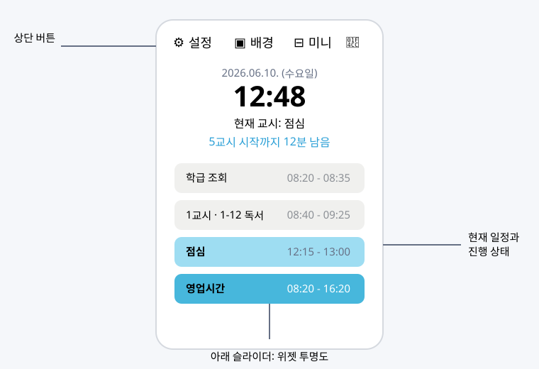
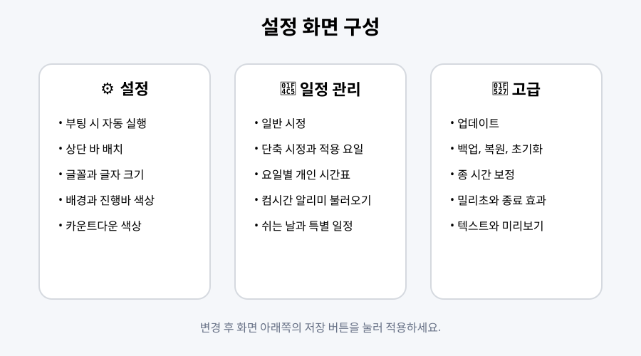

# 지금 몇교시야 사용설명서

## 1. 설치와 실행

### Windows

1. [최신 릴리즈](https://github.com/RamzThunder/whattime-releases/releases/latest)에서 `whattime.exe`를 내려받습니다.
2. 로컬 폴더에 저장한 뒤 실행합니다.
3. Windows 보호 화면이 나타나면 파일 출처를 확인한 후 실행을 선택합니다.

네트워크 드라이브에서 직접 실행하면 연결 지연으로 앱이 멈출 수 있으므로 로컬 폴더 사용을 권장합니다.

### macOS

1. 최신 릴리즈에서 `WhatTime-mac.dmg`를 내려받습니다.
2. DMG를 열고 앱을 Applications 폴더로 옮깁니다.
3. 실행이 차단되면 DMG에 포함된 `install.command`를 실행하거나 시스템 설정에서 허용합니다.

## 2. 메인 화면

메인 화면에는 날짜, 현재 시각, 현재 교시, 다음 일정까지 남은 시간과 오늘의 일정이 표시됩니다.

| 버튼 | 기능 |
| --- | --- |
| 설정 | 시정, 개인 시간표, 디자인과 고급 기능 설정 |
| 배경 | 위젯의 배경 표시 여부 전환 |
| 미니 모드 | 작은 크기의 요약 화면으로 전환 |
| 항상 위 | 다른 창보다 위에 표시 |
| 최소화 | 위젯 최소화 |
| 종료 | 앱 완전 종료 |

창 가장자리를 드래그하면 크기를 조절할 수 있습니다. 아래쪽 슬라이더로 위젯 투명도를 조절할 수 있습니다.

## 3. 설정 화면

설정 화면은 `설정`, `일정 관리`, `고급`, `실험실`의 네 영역으로 나뉩니다. 변경 후 아래쪽 `저장`을 눌러야 적용됩니다.

### 설정

- 부팅 시 자동 실행
- Windows/macOS 스타일 상단 바 선택
- 글꼴, 굵기, 글자 크기 변경
- 전체 배경과 진행바 색상 변경
- 현재 일정, 비활성 일정, 카운트다운 글자 색상 변경

색상 칸의 `+ 추가`를 누르면 자주 쓰는 색상을 저장할 수 있습니다.

### 일정 관리

#### 일반 시정

7교시까지 있는 날을 기준으로 평소 수업일의 시정을 한 번만 입력합니다.
위쪽에서 7교시가 있는 요일만 체크합니다. 체크하지 않은 요일에는 기본 시정의
7교시가 자동으로 제외되어 6교시까지만 표시됩니다.

- `+ 교시 추가`: 새 일정 추가
- `×`: 일정 삭제
- `⊘`: 해당 블록에서 카운트다운 제외
- 드래그: 일정 순서 변경

#### 특별 시정

실제 단축수업이나 행사일의 특별 시간표와 적용 날짜를 설정합니다. 특별 시간표는 최대 30개까지
누적할 수 있고, 각 시간표마다 서로 다른 날짜를 지정할 수 있습니다. 지정 날짜에는 일반 시정보다
해당 특별 시간표가 우선 적용됩니다. 한 날짜에는 하나의 특별 시간표만 연결됩니다.
특별 시정은 정식 기능으로 `일정 관리 > 특별 시정`에서 항상 편집할 수 있습니다.
이 탭의 사용 스위치로 날짜별 적용을 켜거나 끌 수 있습니다. 신규 설정은 켜짐이며 기존 사용 선택은 유지합니다.

HWPX 문서로 시정을 받은 경우 `HWPX에서 새 시간표 추가`를 누릅니다. 문서 표에서 교시명과
`시작 시각 - 종료 시각`을 찾아 별도의 시간표로 추가하므로, 이름과 내용을 확인하고
`이 시간표를 적용할 날`을 선택한 뒤 `저장`을 누릅니다. 직접 만든 빈 시간표도 추가할 수 있습니다.
기존 2.2.x 특별 시정은 업데이트 후 `기존 특별 시간표` 항목으로 자동 이전됩니다.

#### 개인 시간표

요일별 수업명과 교실을 입력합니다. 개인 시간표 정보는 메인 화면의 각 교시 아래에 표시됩니다.

컴시간 알리미를 사용하는 경우:

1. 학교 이름을 검색해 학교코드를 선택합니다.
2. 컴시간 교사용 화면에 표시되는 교사 번호를 입력합니다.
3. `이번 주 불러오기`를 누릅니다.
4. 내용을 확인하고 `저장`을 누릅니다.

학교에서 1학년 5교시를 다른 학년의 점심시간에 운영한다면 `일정 관리 > 개인 시간표`의
`1학년 5교시를 점심시간에 배치`를 켠 뒤 시간표를 다시 불러옵니다.
컴시간의 5교시 반 정보가 1학년일 때만 점심시간 블록으로 옮겨집니다.

#### 쉬는 날

주말, 휴일 또는 특별 일정이 있는 날을 지정합니다. 쉬는 날에도 별도 일정을 추가할 수 있습니다.

### 고급

- 앱 업데이트 확인과 설치
- 설정 백업 및 복원
- 현재 설정을 기본값으로 지정
- 설정 초기화
- 학교 종과 위젯 시간의 초 단위 오차 보정
- 밀리초 표시
- 개인 수업 종료 직전 진행바 색상 변화
- 종료 문구와 쉬는 날 문구 설정
- 특정 날짜·시각 미리보기

### 실험실

- 수업 종료 시 반별 진도 자동 저장
- 자동 저장 시 현재 화면 캡처
- 수업 종료 메모와 화면 저장 옵션을 독립 창에서 입력
- `↺ 기록` 버튼으로 현재 반의 최근 3회 진도와 저장 화면 다시 보기
- `설정 > 실험실 > 진도 자동 저장 > 진도 기록 열기`에서 수업 시간이 아니어도 모든 반의 최근 진도 확인
- 진도 기록 창에서 자동 저장된 기록을 포함한 메모 수정
- 수업 종료 후 확인을 거쳐 Microsoft PowerPoint 정상 종료 (macOS 전용, 문서 저장 확인 지원)
- 데스크탑으로 지정: 수업 시작 알림과 입력 감지에 따른 재알림 (기본 꺼짐)

실험 기능의 스위치를 꺼도 입력한 시간표와 저장된 진도 데이터는 삭제되지 않습니다.

## 4. 자주 쓰는 설정 예시

### 특정 날짜에 단축수업 적용

1. `설정 > 일정 관리 > 특별 시정`을 엽니다.
2. `HWPX에서 새 시간표 추가` 또는 `+ 빈 시간표`를 선택합니다.
3. 만들어진 시간표를 선택하고 `이 시간표를 적용할 날`을 추가합니다.
4. `저장`을 누릅니다.

### 개인 수업과 교실 표시

1. `설정 > 일정 관리 > 개인 시간표`를 엽니다.
2. 요일을 선택합니다.
3. 각 교시에 수업명과 교실을 입력합니다.
4. `저장`을 누릅니다.

### 위젯을 항상 화면 위에 표시

메인 화면의 `항상 위` 버튼을 누릅니다. 다시 누르면 해제됩니다.

## 5. 데이터 관리

Windows에서는 일정 데이터가 실행 파일과 같은 폴더의 `schedule.json`에 저장됩니다. 앱을 다른 폴더로 옮길 때 설정을 유지하려면 이 파일도 함께 옮기세요.

설정 화면의 고급 탭에서 더 안전하게 관리할 수 있습니다.

- `백업`: 현재 설정을 JSON 파일로 저장
- `복원`: 백업 JSON 파일 불러오기
- `기본값 지정`: 현재 설정을 초기화 기준으로 저장
- `초기화`: 지정한 기본값 또는 앱 기본 설정으로 복원

## 6. 업데이트

앱 시작 시 새 버전을 확인합니다. 업데이트가 있으면 안내 창에서 바로 설치할 수 있습니다.

업데이트가 실패하면:

1. 앱을 완전히 종료합니다.
2. 최신 릴리즈의 실행 파일을 내려받습니다.
3. 기존 실행 파일을 새 파일로 교체합니다.

## 7. 문제 해결

### 앱이 실행되지만 화면이 보이지 않음

1. 작업 관리자에서 `whattime.exe`를 모두 종료합니다.
2. 앱을 다시 실행합니다.
3. 계속 발생하면 최신 버전을 다시 내려받습니다.

### 앱이 응답 없음 상태가 됨

- 네트워크 드라이브가 아닌 로컬 폴더에서 실행하세요.
- 실행 중인 앱을 모두 종료하고 다시 실행하세요.
- Windows WebView2 Runtime과 앱을 최신 버전으로 업데이트하세요.

### 설정 창이 열리지 않음

- 메인 앱을 완전히 종료한 후 다시 실행하세요.
- 최신 릴리즈로 업데이트하세요.

### 설정이 사라짐

- 실행 파일과 같은 폴더의 `schedule.json`을 확인하세요.
- 백업 JSON이 있다면 `고급 > 복원`에서 불러오세요.

## 학교 특별시정 구독

`설정 > 일정 관리 > 학교 특별시정 구독`에서 `새로고침`을 누르고 학교를 선택한 뒤 `적용`을 누르세요.
앱 시작 시 한 번 게시된 시정을 확인하고, 새로 추가되거나 수정·취소된 시정이 있으면 받아올지 물어봅니다.
승인해야 적용되며, 거절하거나 연결이 끊기면 마지막으로 받은 시정을 유지합니다.
직접 설정한 특별시정이 같은 날짜에 있다면 그 설정이 우선합니다.
자세한 적용 순서와 관리자 게시 방법은 [학교 구독 안내](SCHOOL_SUBSCRIPTIONS.md)를 참고하세요.

## 월요일 컴시간 자동 갱신과 개인 일정 보존

`설정 > 일정 관리 > 개인 시간표`에 학교코드와 교사 번호를 입력하고 저장하세요.
`매주 월요일 자동 불러오기`는 기본으로 켜져 있습니다.
월요일에 앱을 실행하면 이번 주 시간표를 한 번 불러옵니다. 앱을 켜둔 채 월요일이 되어도 동작합니다.
같은 주에 이미 불러왔다면 앱을 다시 실행해도 중복 수신하지 않습니다.
설정 창을 편집 중이면 닫은 뒤 갱신하며, 마지막 갱신 시각은 개인 시간표 설정에서 확인할 수 있습니다.
월요일에 앱을 실행하지 않았다면 그 주는 `이번 주 불러오기`로 직접 받을 수 있습니다.
연결 실패 시 기존 시간표를 유지하고, 같은 월요일에 앱을 다시 실행하거나 수동으로 다시 불러올 수 있습니다.

- 컴시간에서 받은 칸만 다음 불러오기 때 갱신합니다.
- 급식지도 등 직접 입력·수정한 칸은 자동으로 `직접 입력 유지`가 켜집니다.
- 이 표시가 있는 칸은 자동·수동 불러오기 모두에서 보존합니다. 직접 비운 칸도 유지합니다.
- 컴시간으로 다시 갱신할 칸은 `직접 입력 유지`를 해제하고 저장하세요.
- **이전 버전에서 작성한 칸은 출처 정보가 없어 우선 보호합니다.** 컴시간 수업으로 갱신할 칸은 체크를 한 번 해제해야 합니다.
- 같은 칸에 개인 일정과 컴시간 수업이 겹치면 보호한 개인 일정이 우선합니다.

## 데스크탑 수업 이동 알림

`설정 > 실험실 > 데스크탑으로 지정`을 켜고 저장하면, 개인 시간표에 반이 등록된 수업이 시작될 때 큰 창으로 이동할 반을 안내합니다.
위젯이 최소화되어 있어도 앱이 실행 중이면 확인합니다. 진도 자동 저장 기능과는 독립적입니다.

- 시작 알림은 약 680×480 크기이며 다른 창 위에 표시합니다.
- 수업 시작 20초 이후 새 마우스·키보드 입력이 감지되면 약 880×620 크기의 빨간 재알림을 한 번 표시합니다.
- 입력이 없으면 재알림을 표시하지 않습니다. 입력 내용이나 마우스 좌표는 수집·저장하지 않고 OS가 알려주는 마지막 입력 후 경과 시간만 확인합니다.
- `지금 갈게요!`는 현재 창을 닫습니다. 닫는 클릭만으로 재알림을 띄우지는 않습니다.
- 빨간 재알림 하단의 작은 **이번 시간 알림하지 않기** 버튼은 해당 수업의 남은 알림을 끕니다. 돌아와서 작업해도 다시 알리지 않으며, 다음 수업은 정상적으로 알립니다.
- 쉬는 시간, 급식지도 등 수업 외 일정, 반 정보가 없는 수업에는 표시하지 않습니다.
- 수업 도중 앱을 켰을 때 지난 시작 알림이 갑자기 뜨지 않도록 시작 후 30초가 지난 수업은 건너뜁니다.
- 입력 상태 확인에 실패하면 재알림을 생략하고 시작 알림만 사용합니다. 실험실에서 상태를 확인할 수 있습니다.
- **시작 알림 미리보기 / 재알림 미리보기**로 시간표나 현재 시각을 바꾸지 않고 두 화면을 확인할 수 있습니다.

알림 시각에는 저장한 학교 종 시각 보정을 반영합니다. 고급 설정의 날짜·시각 미리보기는 실제 알림을 발생시키지 않습니다.

실험실의 데스크탑 토글 아래 **알림 꾸미기**를 펼치면 첫 알림, 재알림, 확인 버튼의 문구와 첫 알림·재알림의 배경색 및 글자색을 바꿀 수 있습니다. 확인 버튼도 선택한 색상에 맞춰 표시됩니다. 빈칸은 기본 문구를 사용하며, 미리보기에는 저장 전 편집 내용도 반영됩니다. 실제 수업 알림에 적용하려면 설정을 저장하세요.

알림 꾸미기에서 첫 알림·재알림의 배경 사진도 각각 선택할 수 있습니다. 20MB 이하 JPG·PNG·WebP를 지원하며, 최대 1280px의 JPEG로 변환해 설정에 복사하므로 원본 사진을 옮겨도 유지됩니다. 어둡기는 0~80%로 조절할 수 있고, 사진을 지우면 지정한 배경색으로 돌아갑니다. 사진 선택 시 글자색은 흰색으로 바뀌며 원하는 색으로 다시 변경할 수 있습니다. 저장 전 미리보기와 취소도 기존 설정과 동일하게 동작합니다.
